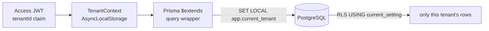

# 01 — Architecture

## Monorepo layout

TFTSP is an **npm-workspaces** monorepo (D-001; Nx/Turbo deliberately avoided). The
root `package.json` declares `apps/api` and `packages/shared-types` as workspaces;
the two Angular apps and the Flutter app keep their own lockfiles so each
workstream stays in a disjoint directory (D-002/D-003).

```
TFTSP/
├── apps/
│   ├── api/            NestJS 10 backend (the only workspace member that is a server)
│   │   ├── prisma/     schema.prisma + migrations 0001–0007 + seed.ts
│   │   └── src/
│   │       ├── main.ts, app.module.ts
│   │       ├── common/     cross-cutting: prisma, tenant, rbac, guards, errors, minio, util, config
│   │       ├── modules/    one folder per domain (see below)
│   │       └── i18n/       ar/ + en/ message catalogues
│   ├── admin-web/      Angular — tribe admin panel
│   ├── platform-web/   Angular — SaaS platform / super-admin panel
│   └── mobile/         Flutter — members app (M5)
├── packages/
│   ├── shared-types/   DTO / entity TypeScript types shared by API + web (workspace)
│   └── shared-ui/      reserved (deferred, D-002)
├── docs/               API_CONTRACT.M1–M5.md + this dev-reference/
├── docker-compose.yml  local infra: postgres, redis, minio, mailhog (+ api service)
├── .github/workflows/ci.yml
└── DECISIONS.md        ambiguity resolutions (D-001 … D-502)
```

### Backend module map (`apps/api/src/modules`)

Modules are grouped by the phase that introduced them, but all ship in the same
build:

- **M1:** `auth`, `platform`, `tenant-settings`, `tribal-units`, `persons`,
  `unions`, `lineage`, `audit`
- **M2:** `change-requests`, `workflow-settings`, `notifications`, `jobs`
- **M2.5:** `imports` (+ `jobs`)
- **M3:** `visibility` (global), `view-requests`
- **M4:** `subscriptions` (global), `documents`, `reputation`, `stats`, `exports`
- **M5:** `devices` (+ FCM channel inside `notifications`)

Each module follows the same shape (see `apps/api/README.md` → "Module
conventions"): thin **controller**, business logic in a **service**, DB access in a
**repository**, request shapes as **dto/**, plus **tests**.

## The four components

1. **`apps/api` — Backend API.** NestJS 10, Prisma 5, PostgreSQL 16 (+ RLS),
   Redis/BullMQ, MinIO, Socket.IO, `nestjs-i18n`, `nestjs-pino`. Owns all data and
   all business rules. Exposes REST under `/api/v1` and two WebSocket namespaces
   (`/notifications`, `/imports`). Swagger at `/api/docs`.
2. **`apps/admin-web` — Tribe Admin Panel (Angular).** The day-to-day tool for a
   tribe's admins/reviewers/contributors: manage persons/unions/units, review
   change requests, run the import wizard, configure visibility & workflow, view
   the d3 tree and stats.
3. **`apps/platform-web` — Platform / Super-Admin Panel (Angular).** Cross-tenant
   operations available only to super admins: create/suspend tribes, assign the
   first tribe admin, manage subscriptions, view the platform dashboard.
4. **`apps/mobile` — Members App (Flutter).** Read-focused app for members,
   contributors and visitors. Consumes the *stable* M1–M4 APIs unchanged; the only
   backend addition for M5 is device registration + an FCM push channel.

Shared contract: **`packages/shared-types`** holds the request/response types so
the API and the web apps cannot drift. The frozen route surface is in
`docs/API_CONTRACT.M*.md`.

## Request lifecycle (backend)

A tenant-scoped HTTP request flows through this pipeline (wired in
`apps/api/src/app.module.ts` and `main.ts`):

```mermaid
sequenceDiagram
    participant C as Client
    participant H as Helmet/CORS/Prefix (main.ts)
    participant JG as JwtAuthGuard (APP_GUARD)
    participant PG as PolicyGuard (APP_GUARD)
    participant TI as TenantContextInterceptor (APP_INTERCEPTOR)
    participant Ctrl as Controller
    participant Svc as Service
    participant Ext as Prisma tenant extension
    participant DB as PostgreSQL (RLS)

    C->>H: HTTP + Authorization: Bearer <access>
    H->>JG: request
    JG->>JG: verify JWT (unless @Public) → req.user
    JG->>PG: 
    PG->>PG: read @RequirePermission / @SuperAdminOnly<br/>check role_assignments (platform client)
    PG->>TI: authorized
    TI->>TI: TenantContext.run({ tenantId, userId, ... })
    TI->>Ctrl: handler runs inside AsyncLocalStorage
    Ctrl->>Svc: dto
    Svc->>Ext: prisma.tenant.<model>.<op>()
    Ext->>DB: BEGIN; SET LOCAL app.current_tenant=<jwt tenant>; <query>; COMMIT
    DB-->>C: rows scoped to the tenant → { ...projection }
```

Key ordering facts:

- **Guards run before the interceptor.** `JwtAuthGuard` populates `req.user` from
  the access token (`jwt.strategy.ts`), then `PolicyGuard` authorizes. Only then
  does `TenantContextInterceptor` bind the tenant context — so authorization
  metadata (`role_assignments`) is read *before* a tenant GUC is set, using the
  trusted platform client (see [05](./05-authz-and-security.md)).
- The handler executes **inside** `TenantContext.run(...)`
  (`tenant-context.interceptor.ts`) using Node `AsyncLocalStorage`, so every
  downstream Prisma call sees the active tenant without threading it manually.
- Errors are serialized by the global `AllExceptionsFilter` to
  `{ statusCode, messageKey, message, details? }` with the message localized.

Global providers (`app.module.ts`): `JwtAuthGuard` + `PolicyGuard` (`APP_GUARD`),
`TenantContextInterceptor` (`APP_INTERCEPTOR`), `AllExceptionsFilter`
(`APP_FILTER`), and a strict `ValidationPipe` (`APP_PIPE`:
`whitelist + forbidNonWhitelisted + transform`). Logging is `nestjs-pino` with a
per-request `request_id` and `tenant_id` on every line; i18n is `nestjs-i18n` with
`ar` fallback and query/header/Accept-Language resolvers.

## Multi-tenancy model

**Shared schema + PostgreSQL Row-Level Security** (Spec §2/§4). Every
tenant-scoped table carries a `tenant_id` column and a composite index that starts
with `tenant_id`. There is exactly one source of truth for the active tenant: the
verified JWT.



Two database planes live in `PrismaService` (`common/prisma/prisma.service.ts`):

- **`prisma.tenant`** — connects as `tftsp_app` (**no `BYPASSRLS`**). RLS-enforced;
  the tenant extension (`prisma.extension.ts`) wraps each model op in a
  transaction that runs `SELECT set_config('app.current_tenant', <id>, true)` (=
  `SET LOCAL`) first. Use for **all** tenant request handling.
- **`prisma.platform`** — connects as the owner role. Used **only** by the trusted
  auth/platform plane (behind `@SuperAdminOnly` or the pre-tenant auth flow) for
  cross-tenant reads, platform tables, and reading `role_assignments`.

A handful of tables are **outside RLS by design** because the auth layer must read
them before any tenant is bound: `tenants`, `users`, `refresh_tokens`,
`role_assignments`, `tenant_subscriptions`, `subscription_activations` (see
D-101/D-102 and [03](./03-data-layer.md), [05](./05-authz-and-security.md)).

Multi-statement work (e.g. person edit + closure-table maintenance) uses
`PrismaService.tenantTransaction(...)`, which sets the GUC once and increments a
per-request `txDepth` counter so the extension does **not** re-wrap inner ops. The
counter (not a boolean) is deliberate: concurrent tenant transactions in one
request (`Promise.all`) must not corrupt the flag, otherwise an inner op could hit
a pooled connection whose GUC reverted to `''` and fail with `''::uuid` (22P02).

## Key decisions (cross-reference `DECISIONS.md`)

These are the architecture-shaping entries; read `DECISIONS.md` for the full log
(D-001 … D-502) and rationale.

| ID | Decision |
|---|---|
| D-001 | npm workspaces (not Nx/Turbo). |
| D-003 | Two separate Angular apps rather than one workspace with two projects. |
| D-004 | The API contract + `packages/shared-types` are the frozen sync point. |
| D-005 | Migrations run as owner `tftsp`; the app connects as `tftsp_app` **without** `BYPASSRLS`. |
| D-006 | Partial dates: year-only stored as `YYYY-01-01`; API accepts `YYYY` or full ISO. |
| D-101 | `role_assignments` kept **out** of RLS so the auth layer can resolve memberships before a tenant is bound. |
| D-102 | Two Prisma planes (`tenant` app role vs `platform` owner role). |
| D-108 | Logo presign stubbed in M1; real presign lands with the M4 document flow. |
| D-301 | M2.5 plan-limit stand-in via `Tenant.max_persons`; superseded by M4 subscriptions. |

Non-negotiable choices (RLS-only tenancy, JWT/Argon2id, closure table, Union
entity, MinIO, d3 tree) come from the spec itself and are summarized in the root
`README.md`.
