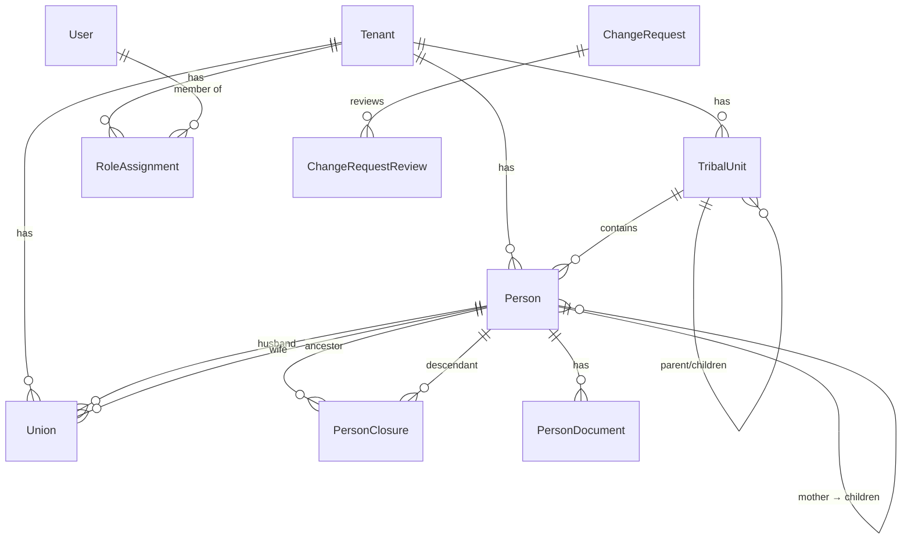

# 03 — Data layer

The data layer is **Prisma 5 + PostgreSQL 16**. The Prisma schema
(`apps/api/prisma/schema.prisma`) is the source of truth for tables and relations,
but the security-critical bits — the `tftsp_app` role, RLS policies, the
`name_normalized` generated column, pg_trgm, and the materialized views — live in
hand-written SQL migrations because Prisma cannot express them.

## Schema tour

### Enums

Domain enums drive most state and typing: `Role`, `TenantStatus`, `Gender`,
`PersonStatus`, `UnitType`, `UnionStatus` (M1); `ChangeTargetType`,
`ChangeOperation`, `ChangeRequestStatus`, `ReviewDecision`, `NotificationType`
(M2); `ImportFileFormat`, `ImportBatchStatus`, `ImportRowStatus`,
`ImportRowDecision` (M2.5); `VisibilityLevel`, `WomenDisplayMode`, `MemberScope`,
`ViewRequestStatus` (M3); `PlanTier`, `SubscriptionStatus`, `DocumentKind`,
`ContributionType`, `TrustLevel` (M4); `DevicePlatform` (M5). The state-bearing
ones are diagrammed in [06 — State machines](./06-state-machines.md).

### Two table tiers

**Platform-level tables — OUTSIDE RLS** (the auth/platform bootstrap tier):

| Model | Table | Notes |
|---|---|---|
| `Tenant` | `tenants` | The tribe. `slug` unique; `maxPersons` (M2.5 stand-in, default 500). |
| `User` | `users` | Global identity; `isSuperAdmin`, `failedLoginAttempts`, `lockedUntil`. |
| `RefreshToken` | `refresh_tokens` | Rotation chain via `familyId`; only the SHA-256 `tokenHash` is stored. |
| `RoleAssignment` | `role_assignments` | Authorization metadata: `(tenantId, userId, role, tribalUnitId?, memberScope?, anchorPersonId?, validFrom, validTo?)`. Kept out of RLS (D-101) so memberships resolve before a tenant is bound. |
| `TenantSubscription` | `tenant_subscriptions` | Plan tier + status per tenant (M4). |
| `SubscriptionActivation` | `subscription_activations` | Manual-activation log (M4). |

**Tenant-scoped tables — UNDER RLS** (every one carries `tenant_id` + a composite
index starting with it): `tribal_units`, `persons`, `unions`, `person_closures`,
`audit_logs` (M1); `workflow_settings`, `change_requests`,
`change_request_reviews`, `notifications` (M2); `import_batches`, `import_rows`
(M2.5); `visibility_settings`, `view_requests` (M3); `person_documents`,
`contributor_reputations`, `reputation_thresholds` (M4); `device_registrations`
(M5).

### Core entities & relations



- **`Person`** is the heart of the tree. Triple-name fields (`firstName`,
  `fatherName`, `grandfatherName`, `familyName`, `laqab`), `gender`,
  partial-date-friendly `birthDate`/`deathDate` (year-only stored `YYYY-01-01`,
  D-006), self-referential `fatherId`/`motherId`, optional `tribalUnitId`,
  soft-delete `deletedAt`, optimistic-lock `version`, and `importBatchId` for
  bulk-import traceability. `biography` (M4) is sanitized rich text.
- **`Union`** models a marriage as its own entity: `husbandId`/`wifeId`,
  `marriageDate`, `status` (`active`/`divorced`/`widowed`), `endDate`/`endReason`.
- **`TribalUnit`** is the org hierarchy (`tribe`/`branch`/`clan`/`family`) via a
  self-referential `parentId`; used for member-scope resolution.
- **`RoleAssignment`** ties a user to a tenant with a role, optionally scoped to a
  `tribalUnitId` (for `branch_admin`) and, for M3, a `memberScope` +
  `anchorPersonId`. `validFrom`/`validTo` implement temporary grants (view
  requests).

## The closure table

`PersonClosure` (`person_closures`) is the transitive-ancestry index (Spec §5).
PK `(ancestor_id, descendant_id)`, columns `tenant_id, ancestor_id,
descendant_id, depth`, indexes on `(tenant_id, descendant_id)` and
`(tenant_id, ancestor_id)`. **depth 0 = the self row** every person has.

It is maintained **entirely in application code** — there are no DB triggers or
maintenance functions. `LineageService`/`LineageRepository`
(`apps/api/src/modules/lineage/`) keep it correct inside the *same* tenant
transaction as the person edit:

- `onCreate` — inserts the self row, then `moveSubtree` under the father.
- `onFatherChange` — first `wouldCreateCycle` guard (rejects with
  `errors.person.self_ancestry`), then `moveSubtree`.
- `onSoftDelete` — detaches: children become roots (`fatherId=null`), then removes
  the person's closure rows.
- `rebuildClosure` — full tenant rebuild (used by import rollback).

Reads (`getAncestors`, `getDescendants`, `getTree`) open their own
`tenantTransaction` so the raw closure SQL runs under RLS, and pass results
through the Visibility Resolver.

## Migrations 0001–0007

All under `apps/api/prisma/migrations/`. Migrations run **as the owner role**
(`tftsp`); the app runs as `tftsp_app`.

| Migration | Adds |
|---|---|
| **0001_init** | Base tables + M1 enums. Pure Prisma DDL, no RLS yet. Closure FKs `ON DELETE CASCADE`. |
| **0002_rls_and_search** | The security core: `pg_trgm` + `uuid-ossp` extensions, the `tftsp_app` role, RLS on the M1 tenant tables, `name_normalized` generated column + trigram index. |
| **0003_change_requests_notifications** | M2 tables + enums; RLS on `workflow_settings`, `change_requests`, `change_request_reviews`, `notifications`. |
| **0004_bulk_import** | M2.5 tables + enums; adds `import_batch` to `ChangeTargetType`, `tenants.max_persons` (default 500), `persons.import_batch_id`; RLS on `import_batches`, `import_rows`. |
| **0005_visibility_view_requests** | M3 tables + enums; adds `role_assignments.member_scope` + `anchor_person_id`; `view_request_submitted` notification type; RLS on `visibility_settings`, `view_requests`. |
| **0006_subscriptions_documents_reputation_stats** | M4: `person_documents`, `contributor_reputations`, `reputation_thresholds` (RLS); `tenant_subscriptions`, `subscription_activations` (no RLS); `persons.biography`; `change_requests.contribution_type`; the two materialized views. |
| **0007_device_registrations** | M5: `device_registrations` (RLS), `DevicePlatform` enum, globally-unique `token`. |

## RLS policies

RLS enforcement rests on one fact: **the app connects as `tftsp_app`, a non-owner
role created `NOBYPASSRLS`.** `FORCE ROW LEVEL SECURITY` is deliberately **not**
used anywhere — `FORCE` only matters for the table *owner*, and the app is never
the owner, so plain `ENABLE` already binds the app role. The owner (`tftsp`)
intentionally bypasses RLS to run migrations, the seed, and the stats refresh.

The `tftsp_app` role (created idempotently in 0002):

```sql
DO $$
BEGIN
  IF NOT EXISTS (SELECT 1 FROM pg_roles WHERE rolname = 'tftsp_app') THEN
    CREATE ROLE tftsp_app LOGIN PASSWORD 'tftsp_app_pw' NOBYPASSRLS;
  END IF;
END $$;
```

Every tenant-scoped table gets the **same** policy, named `tenant_isolation`, with
the `missing_ok = true` form of `current_setting` so an unbound tenant yields
`NULL` (→ zero rows) rather than an error:

```sql
ALTER TABLE "persons" ENABLE ROW LEVEL SECURITY;
CREATE POLICY tenant_isolation ON "persons"
  USING      ("tenant_id" = current_setting('app.current_tenant', true)::uuid)
  WITH CHECK ("tenant_id" = current_setting('app.current_tenant', true)::uuid);
```

The GUC `app.current_tenant` is set per request by the Prisma tenant extension
(`SET LOCAL` via `set_config(..., true)`); see
[05 — AuthZ & security](./05-authz-and-security.md). **Tables deliberately
excluded** from RLS: `tenants`, `users`, `refresh_tokens`, `role_assignments`,
`tenant_subscriptions`, `subscription_activations`.

## Arabic-aware search (`name_normalized` + pg_trgm)

Person search is trigram fuzzy matching over a normalized name. `persons` has a
`GENERATED ALWAYS ... STORED` column that lowercases and folds Arabic
orthographic variants (hamza forms → `ا`, `ى` → `ي`, `ة` → `ه`, strips tatweel +
harakat) using `translate()` (chars with no target are deleted, keeping the
expression `IMMUTABLE` so it is legal in a stored generated column):

```sql
ALTER TABLE "persons"
  ADD COLUMN "name_normalized" text
  GENERATED ALWAYS AS (
    btrim(regexp_replace(
      translate(lower(coalesce("full_name", '')),
                'أإآٱىةـًٌٍَُِّْ', 'اااايه'),
      '\s+', ' ', 'g'))
  ) STORED;

CREATE INDEX "persons_name_normalized_trgm_idx"
  ON "persons" USING GIN ("name_normalized" gin_trgm_ops);
```

Prisma never reads/writes this column (generated columns aren't writable). Search
goes through `$queryRaw` with the trigram similarity threshold from
`DUPLICATE_SIMILARITY_THRESHOLD` (default 0.6), which also powers the person
create-time duplicate pre-check.

## Materialized views (stats)

Migration 0006 defines two matviews, both queried by the **owner/platform** client
with an explicit `tenant_id` filter (they carry no RLS — the owner sees all
tenants at build/refresh time, so query-time filtering is mandatory):

- **`tribe_stats_mv`** — per-tenant person counts (total/living/deceased/male/
  female) grouped by `tenant_id`, plus `refreshed_at`. Has a **UNIQUE index on
  `tenant_id`**, which is the prerequisite that lets the refresh job use
  `REFRESH MATERIALIZED VIEW CONCURRENTLY`.
- **`platform_dashboard_mv`** — single-row platform totals (tribes/active/
  suspended, total persons, total users).

**Refresh strategy:** hourly via a BullMQ repeatable job (`stats-refresh`, cron
`0 * * * *`) plus an on-demand admin trigger (`POST /stats/refresh`). Fast-moving
fields the views don't hold (pending change-request counts, generations) are
live-computed at query time, so `GET /stats/tribe` is always current even between
refreshes. See [08 — Integrations](./08-integrations.md) for the job wiring.
