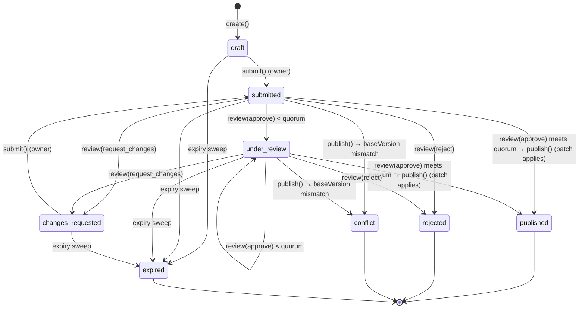
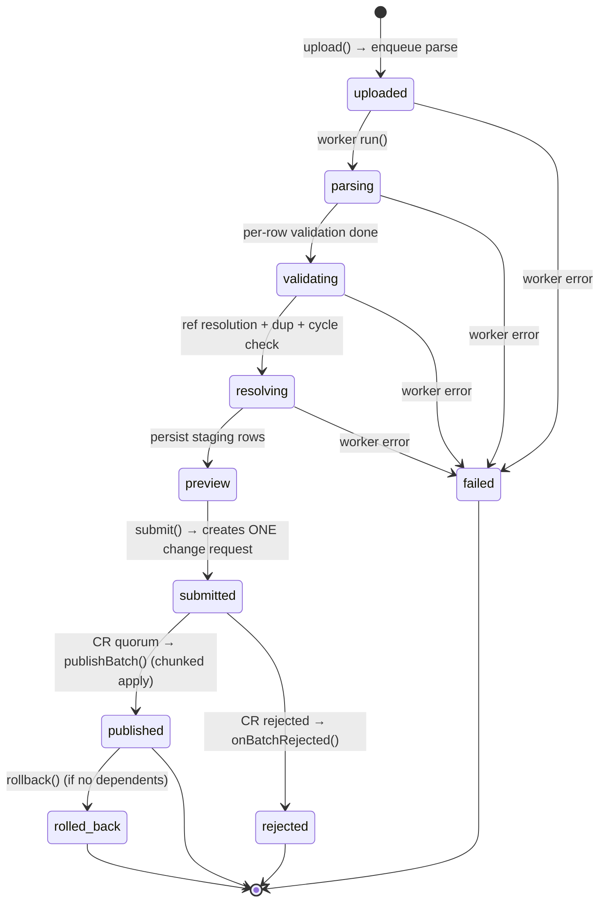
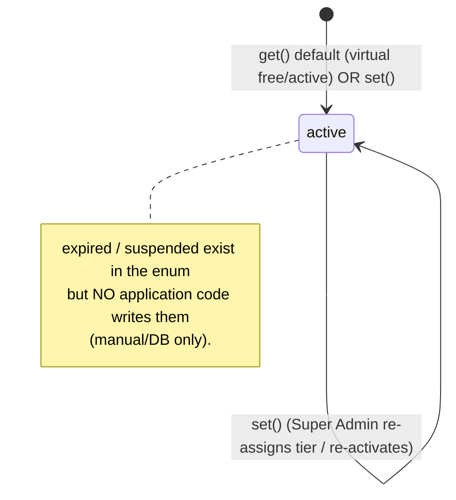
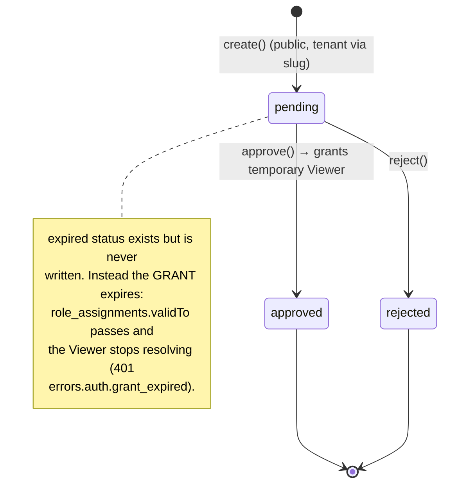

# 06 — State machines

Four domain workflows are modeled as explicit state machines backed by Prisma
enums. This doc gives each one's diagram, transition rules, and the exact
method/file that drives each edge.

> **Schema-only states (important).** A few enum values exist for completeness but
> have **no code path that persists them**: `ChangeRequestStatus.approved`,
> `SubscriptionStatus.expired` / `suspended`, and `ViewRequestStatus.expired`.
> Don't assume they are live states — see the notes under each machine.

## 1. Change requests

Enum `ChangeRequestStatus`:
`draft, submitted, under_review, approved, rejected, changes_requested, published,
conflict, expired`.

Files: `modules/change-requests/change-request.service.ts` (transitions),
`change-request.publisher.ts` (applies the patch),
`modules/jobs/change-request-maintenance.service.ts` (expiry).

Transition rules:

| From → To | Trigger | Guard / rule |
|---|---|---|
| → `draft` | `create()` | Validates the RFC-6902 patch; non-`create` ops require `targetId`. Captures `baseVersion` from `person.version` (person only; union/tribal_unit store `null` → existence-based conflict). Sets `expiresAt = now + expiryDays·86.4M` (default 30d). Contribution rules enforced when `contributionType` set (pending cap, viewer allow-list, visibility). |
| `draft`/`changes_requested` → `submitted` | `submit()` | Must be the owner (`CR_NOT_OWNER`) and in `draft`/`changes_requested` (`CR_INVALID_STATE`). Notifies reviewer roles. |
| `submitted`/`under_review` → `under_review` | `review(approve)` below quorum | Status ∈ {submitted, under_review}; reviewer ≠ author (`CR_CANNOT_REVIEW_OWN`); one review row per reviewer. Waits for more approvals. |
| `submitted`/`under_review` → `published` | `review(approve)` meets quorum → `publish()` | Distinct `approve` count ≥ `approvalsRequired`. **Atomic**: `publisher.apply` runs in a `tenantTransaction` reusing the M1 `*InTx` write paths + lineage. Notifies owner; updates reputation for contributions. |
| `submitted`/`under_review` → `conflict` | `publish()` | The target's `version !== baseVersion` (or target deleted/missing), or an inner `VERSION_CONFLICT` — the patch is **not applied**; owner notified `change_request_conflict`. |
| `submitted`/`under_review` → `rejected` | `review(reject)` | Active status, not own CR. Import batches sync via `onBatchRejected`; contributions decrement reputation. |
| `submitted`/`under_review` → `changes_requested` | `review(request_changes)` | Active status, not own CR. Owner may edit + resubmit. |
| non-terminal → `expired` | `runExpirySweep()` (BullMQ hourly) | `expiresAt < now` and status ∈ {draft, submitted, under_review, changes_requested}. Owner notified. A companion `runExpiryWarning()` (daily) notifies owners within 3 days but does **not** change state. |

**Quorum** = per-tenant `WorkflowSettings.approvalsRequired` (default 1, range
1..3). **`approved` is never stored** — quorum jumps straight to `published`/
`conflict`; `change_request_approved` is only a notification type.

**import_batch CRs** take a special publish path: instead of the generic
single-transaction apply, `publish()` delegates to
`importApplier.publishBatch(cr)` (chunked 1,000 rows/tx) — see machine #2.

## 2. Import batches

Enum `ImportBatchStatus`:
`uploaded, parsing, validating, resolving, preview, submitted, published,
rejected, rolled_back, failed`.

Files: `modules/imports/import.service.ts` (upload/submit/rollback/row edits),
`import-parse.service.ts` (the worker stages), `import-apply.service.ts`
(publish/reject sync).

Transition rules:

| From → To | Trigger | Guard / rule |
|---|---|---|
| → `uploaded` | `upload()` | Streams file to MinIO (magic-byte + 50 MB), then `dispatcher.enqueueParse`. |
| `uploaded`→`parsing`→`validating`→`resolving`→`preview` | `ImportParseService.run()` stages | Each stage calls `ImportProgressService.update()` which persists status/progress and emits `import_progress` over `/imports`. Pipeline: parse+validate → two-pass ref resolution (in-file `ref:` then DB `name_normalized`+clan) → §8 duplicate check (≥0.6) → whole-batch cycle detection → persist rows (1,000/chunk). `preview` awaits human review. |
| any worker stage → `failed` | `run()` catch | Any thrown error sets `failed` + `error` message, then rethrows. |
| `preview` → `submitted` | `submit()` | Must be `preview`. Unless `partial=true`, `error`+`ambiguous` rows must be 0 (`IMPORT_HAS_ERRORS`). Must create ≥1 person (`IMPORT_NOTHING_TO_IMPORT`). Plan cap asserted up front. Creates **one** change request (`targetType: import_batch`) — never a direct write — and links `changeRequestId`. |
| `submitted` → `published` | `publishBatch()` (from CR quorum) | Applies rows in 1,000-row chunks, each its own tx, topologically sorted (Kahn) so in-file parents precede children. Per row: `ignore` → skip; `merge` → update `mergeTargetId ?? duplicateOfId` via the M2 JSON-Patch path; else create tagged with `importBatchId`. |
| `submitted` → `rejected` | `onBatchRejected()` (from CR reject) | Only if still `submitted`. DB unchanged. |
| `published` → `rolled_back` | `rollback()` | Must be `published`. **Blocked** (`IMPORT_ROLLBACK_BLOCKED`, 409) if later records depend on batch persons (external children, unions). Otherwise soft-deletes batch persons, rebuilds closure, audits `import_rollback`. Tribe/Deputy Admin only. |

**Row status** (`ImportRowStatus`) precedence: ambiguous-ref error → `ambiguous`;
other errors → `error`; `duplicateOfId` set → `duplicate_candidate`; else `valid`.
**Row decision** (`ImportRowDecision` `new`/`merge`/`ignore`) is editable via
`PATCH /imports/:id/rows/:rowId` only while the batch is `preview`; resolving an
ambiguous ref clears the error and re-derives status. Only rows that will create a
person consume plan quota.

## 3. Subscriptions

Enum `SubscriptionStatus`: `active, expired, suspended`. Enum `PlanTier`:
`free, basic, professional, enterprise`.

Files: `modules/subscriptions/subscription.service.ts`, `plan-limit.service.ts`,
`plan-limits.ts`.

- **`get()`** returns a virtual `free`/`active` default when no row exists (not
  persisted).
- **`set()`** is the only writer of status — always `active`. It records
  `activatedAt`, `expiresAt` (from the DTO, optional), `activatedBy`, and appends a
  `SubscriptionActivation` audit row. `@SuperAdminOnly`, platform-scoped
  (`/platform/tenants/:id/subscription`).
- **`expired`/`suspended` are never set by code.** `expiresAt` is stored but not
  enforced into a status by any sweep.
- **Plan-limit enforcement** (`PlanLimitService.assertCanAddPersons`): caps are
  `PLAN_LIMITS` = free 500 / basic 5,000 / professional 25,000 / enterprise `null`
  (unlimited). Over cap → `403 errors.subscription.plan_limit_reached` with
  `{ tier, max, current }`. Wired into person-create, import submit, and
  contribution publish (supersedes the M2.5 `Tenant.max_persons` stand-in).

## 4. View requests

Enum `ViewRequestStatus`: `pending, approved, rejected, expired`.

Files: `modules/view-requests/view-request.service.ts`,
`view-request.repository.ts` (`grantViewer`).

Transition rules:

| From → To | Trigger | Guard / rule |
|---|---|---|
| → `pending` | `create()` | **Public** (`@Public`); tenant from `tenantSlug`. If `requireIdForViewRequest` and no `idAttachmentKey` → `VIEW_REQUEST_ID_REQUIRED`. Notifies tribe/deputy admins (`view_request_submitted`). |
| `pending` → `approved` | `approve()` | Permission `viewRequest.manage` (tribe/deputy admin); must be `pending`. `validTo` is **mandatory**. `grantViewer()` creates a temporary Viewer `User` + a `RoleAssignment` (role `viewer`, `memberScope` = `defaultMemberScope`, `validFrom = now`, `validTo` = supplied expiry). Writes `grantedUserId` + `validTo` + `reviewedBy`. |
| `pending` → `rejected` | `reject()` | Same permission; must be `pending`. No user/role created. |

**`expired` is never written.** Temporal expiry is enforced on the *grant*, not the
request: `PolicyGuard` and the visibility resolver filter role assignments by
`validTo IS NULL OR validTo >= now`, so a lapsed Viewer simply stops resolving and
a request after `validTo` yields `401 errors.auth.grant_expired`
(see [05](./05-authz-and-security.md)).
